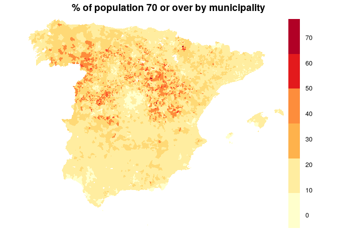

<!-- README.md is generated from README.Rmd. Please edit that file -->

# Aurresku

Chaccour and Brew

<!-- badges: start -->

[](https://www.tidyverse.org/lifecycle/#experimental)
<!-- badges: end -->

Aurresku is a Basque dance. It’s intricate, complex, and meant to honor
those of high stature in the community. It’s also the tentative name of
this project: an intricate, complex attempt at [“the
dance”](https://medium.com/@tomaspueyo/coronavirus-the-hammer-and-the-dance-be9337092b56),
ie the long-term effort to control COVID-19 until there’s a vaccine.

In scientific lingo, we might call this project something like “Guding
post-lockdown COVID-19 confinement policies through an assessment of
spatial-temporal heterogeneity in population vulnerability and
receptivity”.

## The concepts

### A. Receptivity and vulnerability

We borrow two concepts from the world of [malaria
research](https://www.who.int/malaria/mpac/mpac-april2019-session7-report-erg-malariogenic-potential.pdf?ua=1):

1.  Receptivity: how “well-suited” an area is for high-risk cases

2.  Vulnerability: the frequency of influx of infected individuals or
    groups

Understanding the concept through examples:

  - An rural village with a young, healty population would be:
      - Low receptivity (not many people who are likely to develop a
        severe case)
      - Low vulnerability  
  - A coastal town with a high prevalence of elderly retirees:
      - High receptivity (many people predisposed to a severe case due
        to age)
      - High vulnerability (high risk of disease “importation” due to
        tourist movement)
  - A commuter town with a close proximity to an urban center would be:
      - Low receptivity (mostly working-age people below age of
        highest-risk)
      - High vulnerability (lots of movement to and from other areas)
  - An isolated mountain town with an elderly population might be:
      - High receptivity (many people predisposed to severe illness due
        to age)
      - Low vulnerability (very little in/out flow)

### B. Susceptibility and spatial-temporal infection risk

Neither receptivity nor vulnerability can be understood in a vacuum.
Both require incorporating the concepts of susceptibility and
spatial-temporal infection risk

1.  Susceptibility: how much of the population remains uninfected and is
    therefore susceptible to becoming infected and infectious

2.  Spatial-temporal risk: how much disease activity is there nearby
    (understanding “nearby” to be a function of actual flows of human
    mobility, not simple linear distance) at the time in question

### Integrating the concepts: an index

We propose a risk “index”, which takes into account all four of the
aforementioned concepts:

  - A1. Receptivity
  - A2. Vulnerability
  - B1. Susceptibility
  - B2. Spatial-temporal risk

Once constructed, this index serves to determine the level of
“loosening” of social distancing measures so as to (i) minimize loss
of life and health, (ii) maximize social and economic activity, and
(iii) implement the *correct* degree of disease control measures (ie,
robust enough to prevent contagion, but not overly robust so as to
restrict human activity or lead to poor compliance).

## Work-flow

  - A1. Receptivity: We can assess this right now with publicly
    available census data (see below)
  - A2. Vulnerability: We can assess this right now, roughly, by a
    simple flow matrix based on population density (ie, we assume flows
    are between unpopulated areas and more densely populated areas)
  - B1. Susceptibility: We need to carry out mass serology, sampling a
    random but significantly large percentage of the at-risk population
    in every municipality
  - B2. Spatial-temporal risk: We need a constant flow of
    epidemiological data (similar to what the Ministry publishes now,
    but at the municipality level)

# Receptivity

First, we’ll prepare data for analysis.

``` r
# Load the package for this project
library(aurresku)
# Load other useful packages
library(knitr)
library(tidyr)
library(dplyr)
library(sp)
library(ggplot2)
library(RColorBrewer)

# Get census age data
census <- aurresku::census
# Get municipios spatial data
municipios <- aurresku::municipios
```

We’ll define a function for getting “receptivity” (ie, age-based risk)
for each municipality. In this first iteration, we’ll just set it as the
percentage of people who are above age `n`

``` r
define_receptivity <- function(data, n){
  data %>%
    mutate(receptive = edad >= n) %>%
    summarise(pop_receptive = sum(total[receptive], na.rm = TRUE),
              total_pop = sum(total, na.rm = TRUE)) %>%
    ungroup %>%
    mutate(p_receptive = pop_receptive / total_pop * 100)
}
```

We then define receptivity for each municipio in Spain, with an age
cut-off of, for example, 80 years:

``` r
risks <- census %>%
  group_by(municipio, id) %>%
  define_receptivity(n = 80) %>%
  arrange(desc(p_receptive))
```

Let’s take a peak at the most “receptive” municipalities (ie, those
whose populations are most pre-disposed to severe
cases):

``` r
risks %>% head %>% kable
```

| municipio            |    id | pop\_receptive | total\_pop | p\_receptive |
| :------------------- | ----: | -------------: | ---------: | -----------: |
| Riba de Escalote, La | 42157 |             10 |         18 |     55.55556 |
| Olmeda de la Cuesta  | 16140 |             18 |         37 |     48.64865 |
| Ciruelos del Pinar   | 19089 |             16 |         34 |     47.05882 |
| Valdemadera          | 26161 |              4 |          9 |     44.44444 |
| Tormellas            |  5244 |             28 |         65 |     43.07692 |
| Tórtoles             |  5246 |             30 |         73 |     41.09589 |

The below shows the distribution of percentage of people 80 or older by
municipality.

``` r
ggplot(data = risks,
       aes(x = p_receptive)) +
  geom_density(fill = 'darkorange', alpha = 0.6) +
  theme_simple() +
  geom_text(data = tibble(x = c(12, 40),
                          y = c(0.01, 0.01),
                          label = c('Very many\nlow-receptivity municipalities\n(can have more relaxed measures)',
                                      'Very few especially\nhigh-receptivity municipalities\n(need tighter measures)')),
            aes(x = x, y = y, label = label)) +
  labs(title = 'Distribution of receptivity by municipality',
       subtitle = '"Receptivity"= % of inhabitants 80 or older')
```


Let’s think of this another way. If we created an arbitrary cut-off for
relaxing certain measures at, for example, a receptivity of 25% or
lower, we would see:

``` r
x = risks %>%
  group_by(status = ifelse(p_receptive <= 25, 'Relax', 'No-relax')) %>%
  summarise(municipalities = n(),
            population = sum(total_pop)) %>%
  mutate(percentage = round(population / sum(population) * 100, digits = 2))
names(x) <- Hmisc::capitalize(names(x))
x %>% kable
```

| Status   | Municipalities | Population | Percentage |
| :------- | -------------: | ---------: | ---------: |
| No-relax |            206 |      18738 |       0.04 |
| Relax    |           7910 |   46789993 |      99.96 |

Let’s map receptivity (again, using the 80 years cut-off example).

``` r
map <- municipios
map@data <- left_join(map@data, risks, by = 'id')
mycolours <- brewer.pal(8, "YlOrRd")
spplot(map, 'p_receptive', par.settings = list(axis.line = list(col ="transparent")), main = "% of population 80 or over by municipality", cuts = 5, col ="transparent", col.regions = mycolours)
```


We can vary a bit. Let’s do 70 years…

``` r
risks <- census %>%
  group_by(municipio, id) %>%
  define_receptivity(n = 70) %>%
  arrange(desc(p_receptive))
map <- municipios
map@data <- left_join(map@data, risks, by = 'id')
mycolours <- brewer.pal(8, "YlOrRd")
spplot(map, 'p_receptive', par.settings = list(axis.line = list(col ="transparent")), main = "% of population 70 or over by municipality", cuts = 5, col ="transparent", col.regions = mycolours)
```



and 60 years…

``` r
risks <- census %>%
  group_by(municipio, id) %>%
  define_receptivity(n = 60) %>%
  arrange(desc(p_receptive))
map <- municipios
map@data <- left_join(map@data, risks, by = 'id')
mycolours <- brewer.pal(8, "YlOrRd")
spplot(map, 'p_receptive', par.settings = list(axis.line = list(col ="transparent")), main = "% of population 60 or over by municipality", cuts = 5, col ="transparent", col.regions = mycolours)
```


Good. Now we’ve identified especially “receptive” populations (ie, those
with an age structure that puts them at risk). Task A1 (1 of 4) done.

Time to do the other three tasks:

  - A2. Vulnerability
  - B1. Susceptibility
  - B2. Spatial-temporal risk

# Vulnerability

For vulnerability, we want to estimate how much movement there is
between each municipality and other areas. We could do this with raw
data from, for example, mobile networks. But until we have those data,
we’ll use a more simple metric: weighted-distance to nearby population
centers.

Essentially, “vulnerability” means how close you are to large population
centers and how large those population centers are. So, a town that is
15 minutes away from Manresa likely has some intermingling with Manresa;
by the same token, a town adjoining Madrid likely has lots of
intermingliing with Madrid.

Our weighting function looks like this:

``` r
weighter <- function(x){1 / (x^(1/10))}
population_weighter <- function(x){x ^(1/2)}
x <- 1:150
y <- weighter(x)
df <- tibble(x,y)
ggplot(data = df,
       aes(x = x, y = y)) +
  geom_line() +
  theme_simple() +
  labs(x = 'Distance from city',
       y = 'Relative weight',
       title = 'How we understand the importance of proximity')
```


We’ll define vulnerability as the sum of the population of all nearby
(\<150km) population centers weighted by the distance. We calculate this
for every municipality by creating a matrix of distances from
municipality centroids to the nearby (\<150km) population centers.

``` r
# Get cities locations and populations
cities_sp <- aurresku::cities_sp
# Define matrix of distances
distances <- rgeos::gDistance(spgeom1 = municipios,
                              cities_sp,
                              byid = T)
out <- rep(NA, ncol(distances))
for(j in 1:ncol(distances)){
  this_municipality <- municipios@data$NAMEUNIT[j] 
  distance_values <- distances[,j]
  weighted <- population_weighter(cities_sp@data$population) * weighter(distance_values)
  out[j] <- sum(weighted)
}
# Now, for every municipality, we have a vulnerability score
map <- municipios
map@data$vulnerability <- out
```

Having calculated vulnerability score, let’s visualize

``` r
mycolours <- brewer.pal(8, "YlOrRd")
spplot(map, 'vulnerability', par.settings = list(axis.line = list(col ="transparent")), main = "Vulnerability score", cuts = 8, col ="transparent", col.regions = mycolours)
```


Great. We have some concept of vulnerability. It doesn’t stand alone
well (ie, the fact that you’re close to a place only matters if that
place has infections), but that’s what the next steps are for.

# Next steps

What’s next? We need to assess (1) susceptibility and (1)
spatial-temporal risk. Urgently

For (1), we need funds and a team to start preparations for mass
serology. Sampling strategy and timing will be fundamental to getting
actionable data. This will almost certainly be the most expensive, but
also most important, part of this work.

For (2), we need the Ministry of Health to release municipality-level
data as soon as possible. This should be granular (ie, a dataset with
one row per case, with variables including municipality, date of symptom
onset, age, sex, place of diagnosis).

# Technical set-up

This analysis is set-up as an R package. One can install it in one of
two ways:

1.  Clone from <https://github.com/joebrew/aurresku> and then build
    package from source (sequentially walking through the code in
    `data-raw/update.R` and then running `update.sh` from the command
    line).

2.  In an R session, install the package directly from github:
    `devtools::install_github('joebrew/aurresku')`.
